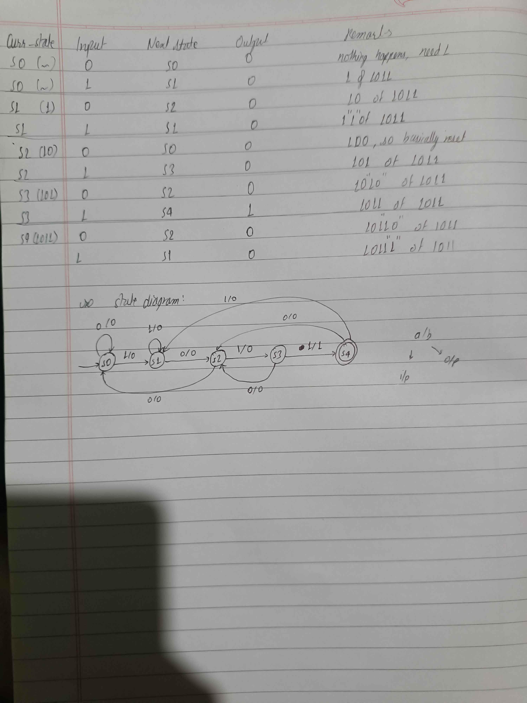

This repository will function as the Past Year Questions' Solution for IoE's Embedded System.

The testbenches, the script that i ran, all of them are present here. However, on any doubt, do open an issue.

But few things i have to get out of the way:
- install `ghdl` and `gtkwave`
- I use 2 distributions: fedora and arch. And this is how you'd install them:
  - fedora: `sudo dnf install ghdl gtkwave`,
  - arch: `sudo pacman ghdl-gcc gtkwave`
- I'm not running all of the vhdl code manually
- There are 2 scripts: `new_vhdl_project.sh` and `run_vhdl_sim.sh` scripts.
- Give them permission to have better utility:
  - run `chmod +x *.sh` at the root directory
- new project script:
  - this script will automatically create a folder `file`, and template for `file.vhd` and `file_tb.vhd`
  - any other file you need to create, you'd have to do it manually, like for structural vhdl
  - if you have `neovim` installed, the file will `file.vhd` will automatically open for you.
  - if you any other software in your `EDITOR` variable of `.bashrc` or `.zshrc`, it will open through that.
- run script:
  - the script assumes that you are in working directory `file` with `file.vhd` and `file_tb.vhd` inside it.
  - this script will automatically open `gtkwave` simulation for `file.vhd` and `file_tb.vhd`.
  - for structural code, where we need another file, you'd first compile your additional code like so: `ghdl -a additional_file.vhd` and then run the script.

And if you are not keen on running someone else's script on your machine, here's how you compile on your own:
- ```ghdl -a *.vhd```
- replace `file_tb` with your test bench file: ```ghdl -e file_tb```
- replace `file.vcd` with your desired file name: ```ghdl -r file_tb --vcd=file.vcd```
- ```gtkwave file.vcd```


### 1. [5] (`81 Ch`, `75 Ba`)
> ```VHDL Code for JK Flip Flop using PROCESS```
- `cd` into `jk_ff` and run the script `../run_vhdl_sim.sh`

### 2. [5] (`80 Ch`)
> ```VHDL Code for 4-bit parallel adder```
- `cd` into `./bpa_4bit/` 
- compile adder: ```ghdl -a full_adder.vhd```
- and run the script `../run_vhdl_sim.sh`

### 3. [6] (`79 Ch`)
> ```Design a traffic light controller unit with necessary assumptions using state machine```
- **Assumptions**
  - using simplified intersection
  - intersection has only 2 way through-traffic possible
  - North (N), South (S), East (E), West (W) are directions.
  - NS can run at one time exclusively, or EW can run at one time exclusively as simiplified demonstration.
  - we use 3 lights: GREEN, YELLOW, RED. Green and yellow can occur of NS while EW is on RED, and vice versa.
  - I am not going to do a full blown actual traffic cycle here.
  - if you wish to, you can run 8 state complicated one too. But its of 6 marks, not 8.
- `cd` into `./traffic_controller/`
- and run the script `../run_vhdl_sim.sh`

### 4. 5 (`78 Ch`)
> ```sequence detector for the sequence 1011 and then develop a VHDL code based on the state diagram```
- State diagram:
  - 
- `cd` into `./seq_detector_1011/`
- run the script `../run_vhdl_sim.sh`
